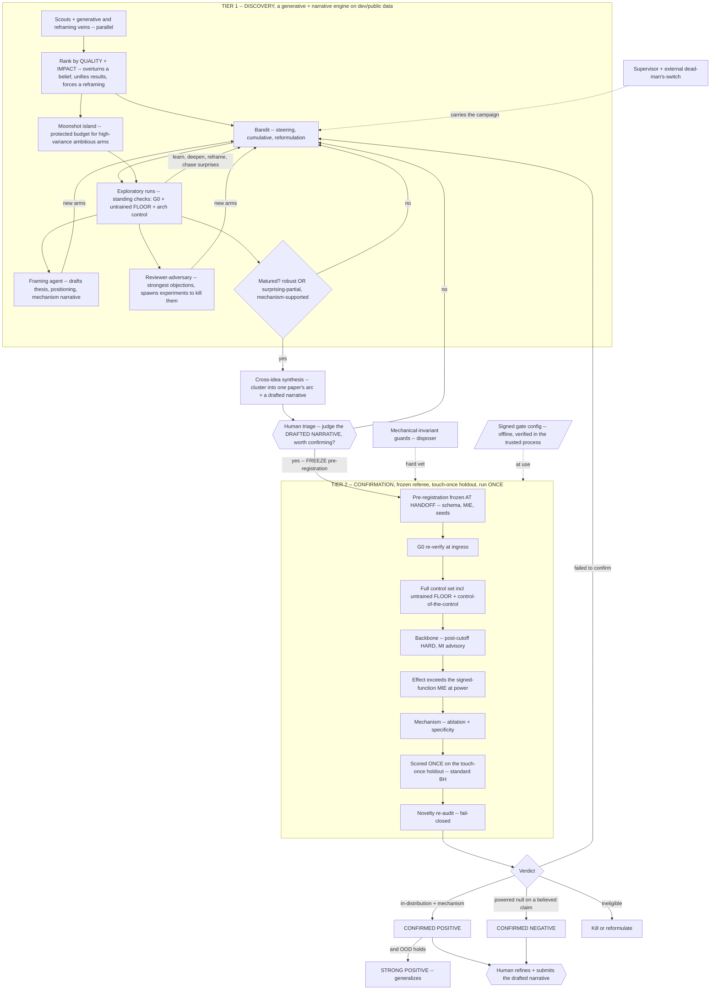

# Self-Sustaining Research Loop -- Architecture Reference

> STATIC ARCHITECTURE REFERENCE (what the loop IS). A two-tier discovery -> confirmation research loop
> for SMILE video-model research. BUILD steps in `PLAN.md`, runtime dependency + failure manifest in
> `TOOL-LEDGER.md`, hard stops in `ANTIPATTERNS.md`.
> Tier 1 (discovery) is a generative + narrative engine that pursues ambitious ideas on dev data,
> deepens them into a mechanism, and drafts the story. Tier 2 (confirmation) is a frozen referee that
> confirms a matured claim once against a held-out set. The deliverable is a drafted, defended,
> confirmed foundational finding, positive or negative, that Vignan refines and submits.

## 1. The principle

**Discovery generates, confirmation referees.** The intellectual center of gravity is Tier 1, which
produces ambition, mechanism, and narrative. Tier 2 is a service, not the product, it decides only
whether a matured claim survives a held-out test.

**Discovery and confirmation are SEPARATE phases.** Research is cumulative, so the exploratory phase
learns from its own results, deepens a lead, reformulates a hypothesis, and chases its surprises.
Statistical validity is protected by walling that learning off from a held-out set that each matured
hypothesis touches exactly ONCE (the discovery-then-replication discipline). Because each hypothesis
touches the holdout exactly once, there is no query budget and no reusable-holdout to over-query.

**Ambition is a first-class objective, not a byproduct of filtering.** Every gate downstream of
discovery only removes things, so a filter can never manufacture a foundational idea. Discovery
therefore scores ideas for IMPACT (overturning a believed position, unifying disparate results,
forcing a reframing), protects high-variance ambitious bets from being pruned by cheap early signal,
and admits a surprising partial result as a lead, not only a clean robust one.

**Truth enters the loop only from outside the model, at the CONFIRMATION boundary.** The confirmatory
disposers (controls, the held-out score, statistics) are authored, tested, and human-signed and
execute in a SEPARATE trusted process over checksummed artifacts, so the untrusted codegen never
shares an interpreter with its referee. The model may PROPOSE and reformulate freely in discovery. It
may never edit or select the disposer that confirms it.

**Two protections carry the validity, and only two.** The untrained-weights FLOOR control (the
geometry-artifact catcher) runs as a standing check in BOTH tiers, and the held-out set is touched
ONCE per matured hypothesis.

**Claim strength is tiered, not conjoined.** An in-distribution, mechanism-supported effect is already
a POSITIVE finding. Out-of-distribution generalization is a SEPARATE, stronger claim, not a mandatory
clause on every positive, because conjoining every gate onto one pass bar rejects most true positives.

**The dominant residual risk is UNDER-detection**, so no confirmatory verdict is admissible unless G0
first proves the pipeline could detect an MIE-sized effect.

## 2. The system

## 3. Tier 1 -- Discovery (the generative + narrative engine)

On dev/public data only. Adaptive, cumulative, and STEERING. This is where ambition, mechanism, and
narrative are produced.

- **Formation and impact ranking.** Scouts propose from mined veins (limitations, future-work,
  contradictions, ablation surprises, assumption relaxation, method transplant) AND generative veins
  (problem re-statement, cross-domain analogy, "what would a new framework assume"). The human may
  seed ambitious directions. The portfolio is ranked by QUALITY and IMPACT, where impact rewards
  overturning a believed position, unifying disparate results, or forcing a reframing, not merely
  passing a novelty-collision check.
- **The bandit is steering and cumulative.** Arms learn from each other's dev-data results, deepen a
  promising lead, reformulate the hypothesis (tighten the claim, change the measure, identify a
  confound), and chase surprises the campaign produced. Wide-shallow with fork-on-stall, and the
  results feed generation rather than being banked non-steering.
- **The moonshot island.** High-variance, high-ambition arms run in a protected budget with their own
  patience, insulated from the main bandit's early-signal pruning, so best-arm dynamics cannot
  collapse the search onto the merely-exploitable (which is systematically the incremental).
- **Maturity admits the surprising partial.** An idea matures when it shows a robust OR a
  surprising-partial mechanism-supported signal on dev data. Foundational reframings first appear
  messy and high-variance, so a clean-robust-only bar would filter exactly them out.
- **The framing agent** continuously drafts, from the accumulating results, the thesis, the
  positioning against the literature, and the mechanism narrative (WHY the effect happens, connected
  to theory, not merely that an ablation survives). Its drafts feed back as new arms that test the
  narrative's own claims.
- **The reviewer-adversary** generates the strongest objections a referee would raise against a
  maturing claim (does it hold at backbone B, dataset D, scale S) and spawns arms that design the
  experiments which would kill the objection. This produces reviewer-completeness and the narrative's
  supporting scaffolding as a byproduct.
- **Cross-idea synthesis** clusters maturing results into candidate ARCS, since a foundational paper
  is one arc several results support, not a bag of independent verdicts.
- **Standing sanity checks, cheap, on every exploratory run:** G0 detectability, the untrained-weights
  FLOOR control, an arch-matched control, and executed-not-fabricated on checksummed data. Cheap early
  filters, NOT the confirmatory gauntlet, so only matured hypotheses pay for the full controls, OOD,
  and mechanism.
- **Maturity + handoff.** At handoff the human triages a DRAFTED NARRATIVE (thesis, positioning,
  mechanism, and the reviewer-defense experiments it survived), not a raw verdict, and decides whether
  it is worth a confirmatory run. On handoff the pre-registration is FROZEN (schema, MIE, seeds).

## 4. Tier 2 -- Confirmation (the referee)

The frozen out-of-process verifier, run ONCE per matured hypothesis against a touch-once holdout. It
is a service that decides whether the drafted claim survives, not the source of the finding.

- Runs in a SEPARATE trusted process over checksummed artifacts, parsing them with SAFE formats only
  (safetensors / `weights_only`, strict-schema JSON, never pickle). The gate library and config are
  mounted read-only by digest and their signatures verified in the trusted process at every use.
- The gates run in this order.
  1. **G0 re-verify** at data ingress (else INELIGIBLE).
  2. **The schema-derived control set** including the untrained-weights FLOOR (a mandatory member of every claim-type, the claim-type derived by a frozen function of the intervention schema, a mismatch is INELIGIBLE), with control-of-the-control (degeneracy vs the measured statistic's null).
  3. **The backbone check** (post-cutoff-date eval is the HARD gate for generalization, membership-inference with its own positive control is ADVISORY).
  4. **The MIE-at-power gate** (the effect must exceed the signed-function MIE at power).
  5. **Mechanism** (ablation + specificity).
  6. **Scored ONCE on the touch-once holdout** with a standard BH correction over the pre-registered confirmatory set.
  7. The fail-closed **novelty** re-audit.
- The MIE is an offline-signed FUNCTION + floor over a magnitude deterministically extracted and
  verified against the source, capped at the floor unless verified.
- The environment FINGERPRINT is defined over a NODE-INVARIANT canonical field set (container digest,
  library versions, GPU model + compute capability, determinism flags), so parallel multi-node seeds
  can legitimately pool, and it is re-verified on resume.

## 5. Verdicts and the output

Claim strength is tiered. Terminal states:

- **CONFIRMED POSITIVE** -- an in-distribution effect that cleared the controls, the MIE-at-power gate,
  mechanism, the once-scored holdout, and novelty. Publishable. Halts.
- **STRONG POSITIVE** -- a CONFIRMED POSITIVE that additionally holds out-of-distribution.
- **CONFIRMED NEGATIVE** -- a powered null (the CI EXCLUDES the MIE) on a believed claim (Scite), with
  G0 passed so the pipeline could have seen the effect. Does NOT require a confirmed mechanism.
  Publishable when it overturns something the field believes.
- **FAILED TO CONFIRM** -- did not clear confirmation and is not a powered null. Returns to discovery
  for reformulation, a fresh pre-registration and a fresh holdout touch, never a re-score.
- **INELIGIBLE** -- a control or pipeline problem. Never science.

**The output is a drafted foundational narrative, not an isolated verdict.** A finding arrives as the
thesis, the mechanism explanation, the positioning against the literature, the reviewer-objection
experiments it survived, and the confirmatory verification, clustered into one paper's arc. Vignan
refines the narrative, judges taste and venue fit, owns the cross-confirmation multiplicity, and
submits.

## 6. The disposers

Confirmation rests on a small set of external disposers.

- The untrained-weights FLOOR control (both tiers), the touch-once holdout (confirmation), G0
  detectability, the frozen out-of-process verifier + signed config + safe deserialization,
  mechanical-invariant guards (a floor, marked for which invariants are evaluable), the external
  corpus for novelty (fail-closed, rejects on a collision, cannot confirm absence), and the human at
  triage and submit.
- Because each matured hypothesis touches the holdout exactly once, the design carries no
  scoring-service or budget-accounting subsystem and no per-arm pre-registration, so there is no
  budget to race on and no reusable-holdout to over-query.
- The impact scoring, the framing agent, and the reviewer-adversary are GENERATIVE, they propose and
  never dispose, and their output is judged by the human at triage and confirmed by Tier 2.

## 7. Autonomy and infrastructure

- **Human placement.** Two cheap touchpoints, a triage of the drafted narrative at the
  discovery->confirmation handoff (where taste is irreplaceable) and the final refine + submit.
- **Supervisor.** The campaign is carried by a self-chaining supervisor via SLURM `--dependency`
  (surviving cert expiry, the maintenance window, compaction), with a two-sided probe, a `GrpTRESMins`
  campaign GPU-hour cap fail-closed at SLURM, a durable human-clearable HALT flag, and an external
  dead-man's-switch. The hardware and cluster-operations source of truth is `/Cluster-Compute` (AICR,
  requestable B200 and RTX PRO 6000 via SLURM).
- **Bandit scheduling.** Bandit priority is mapped onto SLURM job priority (or submitted in priority
  waves), so the intended order survives the concurrency cap rather than being overridden by fairshare.
- **Concurrency.** Everything wide is parallel (scouts, the portfolio, exploratory arms, the moonshot
  island, seeds, the control set, assays, the framing and reviewer-adversary agents). The only true
  dependencies are G0-before-verdict and the once-scored holdout.
- **Guards.** Mechanical-invariant guards are the disposer-grade early-catch. The LLM detectors, jury,
  significance judgment, impact scoring, framing, and reviewer-adversary are advisory or generative,
  judged by the human and the confirmatory referee.

## 8. Parameters

| Item | Setting |
|---|---|
| Tiers | DISCOVERY (a generative + narrative engine on dev data) then CONFIRMATION (a frozen referee, touch-once holdout, run once per matured hypothesis). |
| Center of gravity | Tier 1 produces ambition, mechanism, and narrative. Tier 2 is a referee service, not the product. |
| Ranking | Quality + IMPACT (overturns a belief, unifies results, forces a reframing), not novelty-collision alone. |
| Ambition protection | A moonshot island gives high-variance ambitious arms a protected budget insulated from early-signal pruning. |
| Maturity | Admits a robust OR a surprising-partial mechanism-supported signal. |
| Story production | A framing agent drafts thesis + positioning + mechanism narrative. A reviewer-adversary spawns objection-killing experiments. Cross-idea synthesis clusters results into one arc. |
| Human placement | Triage a DRAFTED NARRATIVE at handoff, then refine + submit. |
| Validity protections | The untrained-weights FLOOR control (both tiers) + the touch-once holdout. |
| Claim strength | Tiered. In-distribution + mechanism = CONFIRMED POSITIVE. + OOD = STRONG. Not conjoined. |
| Verdict precondition | G0 detectability, MIE spike at data ingress, same statistic, on dev/public data, never the holdout. |
| Controls | Schema-derived (mismatch -> INELIGIBLE), the untrained-weights FLOOR mandatory on every claim-type, parametrization frozen from the schema. |
| Backbone | Post-cutoff-date eval is the HARD gate. Membership-inference (with its own positive control) is ADVISORY. |
| Statistics | Standard BH over the pre-registered confirmatory set, scored once on the holdout. alpha=0.05, power 0.8. Campaign-level control is the human submit. |
| MIE | Offline-signed FUNCTION + floor over a deterministically-extracted, source-verified magnitude. |
| Pre-registration | Frozen AT HANDOFF (schema, MIE, seeds). |
| Holdout | Touched ONCE per matured hypothesis. FAILED-TO-CONFIRM returns to discovery for a fresh touch, never a re-score. |
| Fingerprint | Node-invariant canonical field set, so parallel multi-node seeds pool. Re-verified on resume. |
| Negative verdict | Powered null (CI excludes MIE) on a believed claim, G0 passed. Does NOT require mechanism. |
| Novelty / significance / taste | Novelty is a fail-closed hard gate. Significance and impact are advisory. Taste and venue fit are the human's. |
| Autonomy | Discovery runs unattended. A human triages the drafted narrative before the confirmatory tier, then refines and submits. |

## 9. Known limitations

1. Single trust root, the whole confirmatory tier reduces to one human audit of the frozen gate library.
2. Self-reported cutoff dates, the post-cutoff hard gate rests on the HF model-card cutoff.
3. Membership inference is near-chance on large VLMs, hence advisory-only.
4. Novelty rejects on a collision but cannot confirm absence (fail-closed).
5. G0 proves detectability of an MIE-sized effect, necessary but not sufficient for the effect's shape.
6. Impact and ambition scoring are model judgments (advisory). The human triage of the drafted narrative is where ambition is ultimately judged, so the quality of that judgment caps the ambition of the output.
7. Cross-confirmation multiplicity (several confirmations per run) is controlled by the human submit, not an automated campaign-wide correction.
8. Compute must be sized so G0 passes and the holdout has power for the MIE at feasible video-FM cost, which is the binding throughput constraint. Sized against `/Cluster-Compute` (AICR), the hardware source of truth.
