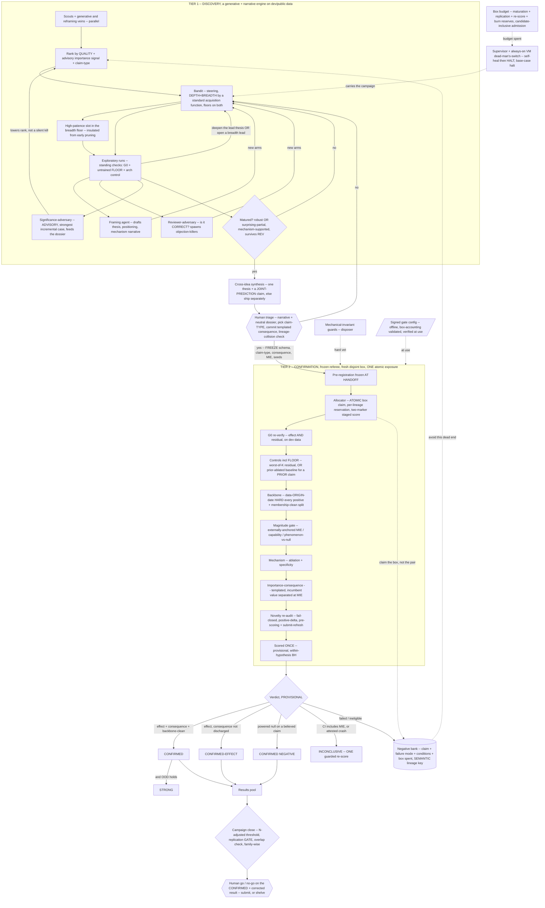

# Self-Sustaining Research Loop -- Architecture Reference

> STATIC ARCHITECTURE REFERENCE (what the loop IS). A two-tier discovery -> confirmation research loop
> for SMILE video-model research. BUILD steps in `PLAN.md`, runtime dependency + failure manifest in
> `TOOL-LEDGER.md`, hard stops in `ANTIPATTERNS.md`.
> Tier 1 (discovery) is a generative + narrative engine that pursues ambitious ideas on dev data,
> deepens them into a mechanism, and drafts the story. Tier 2 (confirmation) is a frozen referee that
> confirms a matured claim once against a fresh held-out box. The deliverable is a drafted, defended,
> confirmed foundational contribution, positive or negative, that Vignan refines and submits.

## 1. The principle

**Discovery generates, confirmation referees.** The intellectual center of gravity is Tier 1, which
produces ambition, mechanism, and narrative. Tier 2 is a service, not the product. It decides only
whether a matured claim and its importance-consequence survive a held-out test.

**Discovery and confirmation are SEPARATE phases.** Research is cumulative, so the exploratory phase
learns from its own results, deepens a lead, reformulates a hypothesis, and chases its surprises.
Statistical validity is protected by walling that learning off from held-out data that each matured
hypothesis touches exactly ONCE (the discovery-then-replication discipline). The held-out set is
carved up front into DISJOINT, powered SHARDS (sealed "boxes"), and each matured hypothesis is scored
against a FRESH box, once, with no box ever reused. Because no box is reused, discovery's adaptive
feedback cannot leak into the data that judges it, so there is no reusable-holdout to over-query and
no query-budget subsystem to race on.

**Selection is corrected as a GATE, not disclosed.** Over a campaign many hypotheses score their own
boxes, so a headline is the survivor of a selection. Score-time verdicts are PROVISIONAL. A
submit-bound headline must clear an N-adjusted threshold over the matured-and-scored count AND pass a
SECOND fresh-box replication as a conjunction gate (both boxes pass), not merely a magnitude estimate.
The campaign-wide expected false-family count is surfaced to the human, and the residual is honest
arithmetic reported per lineage and per family.

**Depth and breadth are balanced on the margin.** A foundational paper wants one deep arc, but a
campaign that goes all-in on one muddled lead makes no progress. A signed budget split reserves a
floor for DEEPENING the current lead thesis (with a minimum decisive-experiment count, not only a
compute floor) and a floor for BREADTH (with a cap on concurrent breadth families). Non-floor compute
is allocated by a standard bandit acquisition function, the floors carrying the protection. The deep
arc is the headline, and genuinely independent strong findings still ship as separate papers.

**Ambition is a first-class objective, not a byproduct of filtering.** Every gate downstream of
discovery only removes things, so a filter can never manufacture a foundational idea. Importance is a
structured claim-TYPE the human selects at handoff (overturning, unifying, reframing, capability), not
a calibrated taste-score the loop cannot build. It is ADVISORY for ranking in discovery, so an
agreeable model never silently kills an ambitious idea, and it earns TEETH at the handoff, where the
human commits a pre-registered consequence drawn from a signed CONSEQUENCE-TEMPLATE keyed to the
claim-type, which Tier 2 must confirm. Importance is enforced by out-of-process confirmation of a
templated, human-set claim, never an LLM veto and never a self-serving robustness check.

**The bar is anchored outside the human.** The MIE is not a free number. It is derived in the trusted
process from a signed distribution of recent ACCEPTED-paper effect sizes on the task (a percentile
floor, strictly above the MDE detectability floor), and its percentile position is shown in the
go/no-go dossier, so "CONFIRMED" reflects a real field bar rather than a self-set one.

**Truth enters the loop only from outside the model, at the CONFIRMATION boundary.** The confirmatory
disposers (controls, the held-out score, statistics) are authored, tested, and human-signed and
execute in a SEPARATE trusted process over checksummed artifacts, so the untrusted codegen never
shares an interpreter with its referee. The model may PROPOSE and reformulate freely in discovery. It
may never edit or select the disposer that confirms it, and it cannot draw a weaker grader by phrasing,
because a single trusted schema-normal-form derives the control set, the lineage key, and the
magnitude gate as the STRICTEST consistent with the schema.

**Two protections carry the validity, and only two.** The untrained-weights FLOOR control (the
geometry-artifact catcher) runs as a standing check in BOTH tiers, and each matured hypothesis is
scored ONCE against a FRESH disjoint holdout box.

**Claim strength is tiered, not conjoined.** An in-distribution, backbone-clean, mechanism-supported
effect that discharges its importance-consequence is already a POSITIVE finding. Out-of-distribution
generalization is a SEPARATE, stronger claim, not a mandatory clause on every positive, because
conjoining every gate onto one pass bar rejects most true positives.

**The dominant residual risk is UNDER-detection**, so no confirmatory verdict is admissible unless G0
first proves the pipeline could detect an MDE-sized effect and residual, and a real but underpowered
result is filed INCONCLUSIVE, never a proven null.

## 2. The system

## 3. Tier 1 -- Discovery (the generative + narrative engine)

On dev/public data only. Adaptive, cumulative, and STEERING.

- **Formation and importance.** Scouts propose from mined veins (limitations, future-work,
  contradictions, ablation surprises, assumption relaxation, method transplant) AND generative veins
  (problem re-statement, cross-domain analogy, "what would a new framework assume"). The human may
  seed ambitious directions. The portfolio is ranked by QUALITY and an ADVISORY importance signal (the
  significance-adversary's read plus the selected claim-TYPE), not a pretend-calibrated taste score and
  not novelty-collision alone. Importance is a structured claim-TYPE, not a number the loop must
  calibrate against a corpus that does not exist.
- **The bandit balances depth and breadth by value-of-information.** Arms learn from each other's
  dev-data results, deepen the lead thesis, reformulate the hypothesis (tighten the claim, change the
  measure, identify a confound), and chase surprises. A signed split holds a floor for the lead thesis
  (a minimum decisive-experiment count) and a floor for breadth (a cap on concurrent breadth
  families), and non-floor compute is allocated by a standard bandit acquisition function (Optuna's, not
  a bespoke value-of-information estimator, the floors carry the protection), so the campaign forms an
  arc without stalling or fragmenting past K papers.
- **The negative bank makes failure cumulative.** Every failed, ineligible, or confirmed-negative
  hypothesis is recorded with a PRECISE, structured entry holding the exact claim (schema-level), the
  exact failure mode (under-powered, geometry-artifact, control-failed, ineligible, powered-null), the
  exact conditions (backbone, dataset, scale, measure), and the box it spent. The lineage KEY is a
  deterministic function of a SEMANTICALLY-CANONICALIZED schema (measures unit-normalized, dataset
  identity canonicalized) computed in the trusted process, so a reworded but equivalent claim hashes to
  the SAME lineage and only a genuinely different claim hashes fresh. The generative tier never judges
  lineage. Because any finite canonicalizer has blind spots, the human's lineage-collision check at
  triage is a SEMANTIC near-neighbor review of the claim against the embedding-nearest bank entries, not
  a spent-key equality check (which would be circular with the very key a reformulation games).
- **Ambition protection is a high-patience breadth slot.** The breadth floor reserves a high-patience,
  high-variance slot (folding what would be a separate moonshot island into one budget mechanism),
  insulated from the main bandit's early-signal pruning, so best-arm dynamics cannot collapse the search
  onto the merely-exploitable.
- **Maturity admits the surprising partial.** An idea matures when it shows a robust OR a
  surprising-partial mechanism-supported signal on dev data AND survives the reviewer-adversary (is it
  correct?). Importance is not a silent maturity gate.
- **The framing agent** drafts, from the accumulating results, the thesis, the positioning, and the
  mechanism narrative. Its drafts feed back as new arms that test the narrative's own claims.
- **The reviewer-adversary** generates the strongest CORRECTNESS objections and spawns objection-killing
  arms. Surviving it is a maturity condition.
- **The significance-adversary** builds the strongest "incremental / already-known" case. It is ADVISORY,
  it lowers importance rank and carries its strongest un-rebutted case into the dossier. It never
  silently kills a maturation.
- **Cross-idea synthesis** clusters maturing results into an ARC and emits ONE explicit thesis whose
  held-out-testable JOINT PREDICTION is pre-registered as its OWN confirmable claim. If the joint
  prediction has no confirmable, incumbent-separated consequence the findings ship separately.
- **Standing sanity checks** on every exploratory run: G0 detectability, the untrained FLOOR, an
  arch-matched control, executed-not-fabricated on checksummed data.
- **Maturity + handoff.** At handoff the human triages the DRAFTED NARRATIVE alongside a NEUTRAL
  dossier authored by a party other than the framing agent (the raw dev effect, the k closest priors
  verbatim, the significance-adversary's strongest case, the MIE percentile against accepted-paper
  effect sizes, and a COMMENSURABILITY line, does discharging this consequence actually establish the
  importance-claim). The human picks the claim-TYPE, commits the templated consequence, and runs the
  lineage-collision check. On handoff the schema, claim-type, consequence, MIE, and seeds are FROZEN.
  A top-importance high-patience maturation is guaranteed a confirmation box, and killing a top-ranked
  maturation at triage requires a logged written reason.

## 4. Tier 2 -- Confirmation (the referee)

The frozen out-of-process verifier, run ONCE per matured hypothesis in a SINGLE atomic exposure of a
fresh disjoint holdout box.

- Runs in a SEPARATE trusted process over checksummed artifacts, parsing them with SAFE formats only
  (safetensors / `weights_only`, strict-schema JSON, never pickle). The gate library and config are
  mounted read-only by digest and verified at every use. A single trusted schema-normal-form derives
  the control set, the lineage key, and the magnitude gate.
- **Claim-types.** EFFECT (exceeds the externally-anchored MIE at power), QUALITATIVE-PHENOMENON (a
  signed separation over a pre-registered null/baseline rate), CAPABILITY (the model does X that a
  pre-registered incumbent cannot, a separation over the incumbent's held-out success rate), and
  LAW-SHAPE (a pre-registered functional-form prediction confirmed across held-out scales, used only
  where the scale sweep fits the single-GPU 24h envelope, else scoped out). MULTI-BENCHMARK SUPERIORITY
  (a signed margin over the current SOTA across K boxes) is DEFERRED for the first campaign and fenced
  out of the campaign-one core (no K-box demand in the coverage invariant). MDE (detectability, for power
  and G0) is split from MIE (interest, a HIGH accepted-effect percentile, top-quartile not median,
  strictly above MDE, with a stated fallback when a task has no accepted-effect distribution). Strength
  scales with the confirmed magnitude on a band ladder.
- **Box exposure and the lease.** The allocator ATOMICALLY claims the box itself (the box, not the
  (hypothesis, box) pair, is the serialization key, so two different-lineage maturations cannot both
  claim one live box) and takes a per-lineage reservation on top (the sequential-reformulation gate).
  Scoring is staged in ONE ACID store (SQLite today, Postgres in production). A `reserved` marker is written pre-launch, a
  `label-read` marker is committed AND read-back-verified BEFORE the first label byte is read (if that
  commit fails the job HALTs and never reads, so a `reserved`-only box provably means unread), then the
  score is durably staged, then one atomic spend commits the score and writes the bank entry. NOTHING
  bandit-visible or MLflow-visible is written before that spend, so the single durable emission point
  makes "no staged score" mechanically imply "nothing leaked". On resume, a staged score RE-COMMITS
  idempotently (the box is not re-touched), `label-read` with no staged score BURNS and writes a
  durable burned-re-score-pending lineage record (routed to a supervisor-attested INCONCLUSIVE crash
  and the one clean re-score), `reserved` with no `label-read` RECLAIMS only after `sacct`/`squeue`
  confirms the reserving job is TERMINAL AND a lease-generation bump fences it, no marker RECLAIMS. The
  box lease carries a monotonic GENERATION that a reclaim bumps, and the `label-read` commit is a
  compare-and-set against the current generation, so a partitioned orphan the controller falsely marked
  terminal fails the CAS and HALTs before reading the first byte (touch-once stays airtight even under a
  false-terminal, not merely detected after the fact). The negative bank and the burned-pending record,
  not a held reservation, enforce the one-grant. The `/work` snapshot is advisory reconstruction only, never a two-phase record.
- All box-touching gates below run in that ONE atomic exposure, and the backbone cohort is a separate
  accounted held-out resource (its own disjointness guarantee and ledger entry), never a second touch
  of the scoring box. The gates run in order.
  1. **G0 re-verify** at ingress, detectability of an MDE-sized effect AND residual (else INELIGIBLE).
  2. **The control set** including the untrained FLOOR (mandatory as the geometry-artifact catcher). For a normal claim the FLOOR is a SEPARATION gate, trained-minus-untrained residual exceeds the MIE at power, the untrained control measured PAIRED over K pre-registered inits at the WORST-CASE (upper-CI) untrained effect, and the box (and the step-22 power curve) sized against THAT worst-case residual. For an architectural-PRIOR claim the artifact-catcher is instead a prior-ablated baseline, the effect must separate from an architecture-matched model carrying an alternative prior DRAWN BY THE SCHEMA FUNCTION FROM A SIGNED CATALOG of standard priors for the architecture class (worst-case over the catalog, never authored at handoff, mirroring the worst-of-K untrained floor), at init and after training, so works-at-initialization counts for the contribution while a pure geometry artifact still fails.
  3. **The backbone check**, evaluation on data whose earliest public-availability (ORIGIN) date post-dates the backbone cutoff, AND a membership-verified clean split, together whenever a box is drawn from any pre-existing corpus. Where the backbone's training set is not enumerable (the usual case for a foundation model), the membership leg cannot cover backbone-pretraining contamination, so a stricter ORIGIN-date margin is required and the finding is marked "origin-date-verified only" in the dossier rather than passed as backbone-clean.
  4. **The magnitude gate** (the externally-anchored MIE-at-power, or the capability / phenomenon / law-shape separation).
  5. **Mechanism** (ablation + specificity).
  6. **The importance-consequence gate**, the pre-registered templated consequence is confirmed on held-out data AND the incumbent's predicted value (the incumbent DRAWN FROM A SIGNED PER-TASK CATALOG whose entry is the STRONGEST provenance-verified published held-out result on the task at campaign start, not free-chosen and not a strawman, on the same per-cycle re-sign/refresh policy as the MIE) is separated from the claimed value at MIE. The template is an anti-HARKing pre-registration device that fixes in advance what would count and confirms magnitude, the PROPOSITION-importance itself remains the human's judgment (the commensurability line + the go/no-go). An effect that confirms without discharging its consequence is CONFIRMED-EFFECT, below the foundational tier.
  7. **Novelty re-audit** (fail-closed, positive-delta), pre-scoring and REFRESHED at submit, a stale corpus HALT-retries rather than failing a scored finding.
  8. **Scored ONCE** with standard BH WITHIN this hypothesis's pre-registered set, a PROVISIONAL verdict, never online BH across hypotheses.
- Box-sizing variance is derived from a held-out-ADJACENT calibration cohort (disjoint from every
  scoring box), with a pre-registered variance-inflation margin, so a modest variance mis-estimate does
  not flip the verdict.
- The FINGERPRINT is node-invariant. Confirmatory scoring is SINGLE-GPU by default within the 24h batch
  wallclock (asserted at admission, a residual box too large for that envelope is a pre-registration
  HALT-and-page, never a submit-then-burn), so no NCCL/GPU-count pin and a driver bump does not strand
  a resume. Any unavoidable multi-GPU confirmation pins those and pages on a resume mismatch.

## 5. Verdicts and the output

Verdicts are PROVISIONAL at score-time and tiered by magnitude. Terminal states:

- **CONFIRMED** -- in-distribution, backbone-clean, mechanism-supported, importance-consequence
  discharged, cleared the magnitude gate, novelty, and the once-scored box. Strength scales with
  magnitude. Enters the pool. The campaign does NOT halt.
- **CONFIRMED-EFFECT** -- the effect confirmed but its importance-consequence did not. Real, still
  pooled and a submittable candidate (foundational-ness is the human's call at go/no-go, not this label).
- **STRONG** -- a CONFIRMED that additionally holds out-of-distribution.
- **CONFIRMED NEGATIVE** -- a powered null (CI excludes MIE) on a LOAD-BEARING believed claim (Scite,
  weighted by citation support and contested-claim tallies, which parks a deferred check and never
  blocks the pool), G0 passed, mechanism not required. A weakly-held belief routes to the pool as
  evidence, not a standalone shippable deliverable.
- **INCONCLUSIVE (crash)** -- a supervisor-attested crash lost the score (a `label-read` burn) with
  nothing having reached durable state or the bandit (structurally true, since nothing is emitted
  before the spend). Granted exactly ONE clean guarded fresh-box re-score of the same claim, then
  terminal. The crash must be supervisor-attested, never self-reported.
- **INCONCLUSIVE (underpowered)** -- the CI includes the MIE. This IS durable verdict information, so it
  is terminal by default (the fix is up-front box sizing). A re-score is allowed only under an explicit
  two-exposure within-claim correction, and it is counted as two tests in the selection N.
- **POWERED-NULL / FAILED / INELIGIBLE** -- recorded in the negative bank. A reformulation earns a
  fresh box only for a genuinely different CLAIM (semantic lineage key), never a relabel.

**The campaign runs the depth/breadth balance to budget.** Confirmed findings accumulate in the pool.
At the base case (boxes or GPU-hours exhausted, or max-maturations reached, with the replication and
re-score reserves held back), the campaign closes in order. A DEPTH-COMPLETION check first asks whether
the lead arc discharged its foundational milestone, the arc's joint-prediction claim pre-registered and
frozen at cross-idea synthesis (when the thesis first exists) confirming on its own box, and if not the
honest terminal state is "no foundational arc this campaign" (a valid non-loss), with breadth-only
confirmations labeled NOT the intended deliverable. Then a SELECTION correction where EVERY
submit-bound claim (not only the headline) clears an N-adjusted threshold over the MATURED-AND-SCORED
count (the selection family, since the winner is a max over that many looks) AND passes a second
fresh-box replication conjunction gate, its reported
magnitude and MIE percentile read from the unbiased REPLICATION box, then a post-confirmation re-check
against each ACTUAL confirmed magnitude, then an overlap check (two findings overlap when they share a
mechanism, a backbone-phenomenon, or the thesis claim, decided by the trusted schema function with a
conservative merge-by-default). Independent findings become separate families, a merged arc gets a
family-wise correction across its confirmations and ships as one paper only if its joint-prediction
claim (pre-registered with a stated reason it is NOT entailed by any single constituent finding, a
union-level consequence not a conjunction of the parts) confirmed on its own box. The pool reports the expected false-positive count per lineage and per
family, and the campaign-wide expected false-FAMILY count.

**A human go / no-go closes every submission**, judged on the REPLICATION-box magnitude (its MIE
percentile shown as a magnitude coordinate, NOT an importance verdict) with the significance-adversary's
strongest incremental case as a co-equal headline of the dossier, with an explicit "confirmed but not worth
submitting" exit that does not count as a loss. The output is a drafted narrative under one thesis (with
the confirmed joint prediction), the mechanism, the positioning, the objection experiments it survived,
the neutral dossier, and the confirmatory verification. Vignan judges taste and venue fit and submits.

## 6. The disposers

- The untrained FLOOR (both tiers, worst-of-K, or the prior-ablated baseline for a prior claim), the
  fresh disjoint boxes + the allocator (atomic box claim, per-lineage reservation, two-marker staged
  commit), G0, the frozen out-of-process verifier + signed config + safe deserialization + the single
  trusted schema-normal-form, the importance-consequence gate (templated, incumbent-separated), the
  external MIE anchor, mechanical-invariant guards, the novelty corpus (fail-closed positive-delta,
  pre-scoring + submit-refresh), the negative bank (a durable precise failure record whose semantic
  lineage key gates a fresh box), and the human at triage and the go/no-go submit.
- Because each matured hypothesis is scored once against a fresh disjoint box and no box is reused, the
  design carries no reusable-holdout to over-query and no query-budget subsystem. The only bookkeeping
  is the append-only box-lease ledger and the negative bank, written in one transaction.
- The importance signal, the framing agent, the reviewer-adversary, and the significance-adversary are
  GENERATIVE or ADVISORY. Importance is disposed only as the human-committed, templated CONSEQUENCE
  confirmed by Tier 2.

## 7. Autonomy and infrastructure

- **Human placement.** Two touchpoints. A triage of the narrative + neutral dossier at the handoff,
  where the human picks the claim-type, commits the templated consequence, and runs the
  lineage-collision check, and a final go/no-go on the confirmed, selection-corrected result. The loop
  runs unattended between them and is built to make faults RARE and LOUD.
- **Supervisor.** A self-chaining supervisor via SLURM `--dependency`, a two-sided probe, a
  `GrpTRESMins` GPU-hour cap fail-closed at SLURM, a durable human-clearable HALT flag, and an external
  dead-man's-switch on a genuinely ALWAYS-ON VM (never the laptop, never a preemptible scavenger).
  Alerts route through TWO independent transports disjoint from the escalation path plus a positive
  "alerting-path OK" heartbeat Vignan watches. Hardware source of truth is `/Cluster-Compute` (AICR).
- **Deterministic failure response.** A bounded self-heal (retry the same tool or recompute from the
  last green point, capped at N), else HALT and page. QUARANTINE recompute is capped and promotes to
  HALT. Never a substitute tool, a skipped step, or an unbounded recompute.
- **Guaranteed termination (the base case).** The campaign provably halts when GPU-hours, LIVE boxes, or
  max-maturations are spent. The coverage invariant is TWO-DIMENSIONAL. Over LIVE boxes, `live_boxes >=
  sum per-maturation demand + per-family replication reserve + a correlated re-score-and-burn contingency
  + a backbone-cohort reserve`, sized JOINTLY (a re-score can itself burn) rather than as independent
  margins. AND a matching GPU-HOUR reserve for the held-back replication, re-score, and burn scores, so
  the GPU-hour base case fires at `hard_cap minus that reserve` and admission is checked against the
  reduced ceiling (a reserved box is useless if no compute remains to score it). The base case fires
  while both reserves are still held. A signed config-validation gate asserts this accounting CLOSES
  before a campaign starts AND is re-run as a precondition of any mid-campaign ceiling raise.
- **Admission control is candidate-inclusive on GPU-hours AND wallclock.** A job launches only if
  `spent + drain(running) + candidate walltime x GPUs <= hard cap` and `candidate walltime <= 24h`,
  where `drain(running)` is the sum of running jobs' SLURM TIME-LIMIT reservations (a guaranteed
  over-estimate, not expected walltime), so no confirmatory job is killed mid-score by either ceiling.
  Raising a ceiling updates the signed config AND the SLURM QOS AND re-runs the closure validator,
  verified on resume.
- **Concurrency.** Discovery fan-out is parallel in intent, delivered as priority-ordered waves.
  Exploratory arms are short and may run on the batch partition so breadth is not hard-capped at the
  devel 4-concurrent limit, and the signed budget states the real wave width and confirmation
  concurrency with a sizing check that confirmation_throughput x campaign_wallclock >= max_maturations
  AND expected_maturation_rate <= human_triage_capacity. The single human triage is the throughput
  ceiling, so the supervisor throttles discovery ADMISSION PREDICTIVELY against projected maturations
  from in-flight arms (not only the current backlog count), never drops a matured hypothesis, and pages
  when the backlog is sustained.
- **Guards.** Mechanical-invariant guards are the disposer-grade early-catch. The LLM detectors, jury,
  importance signal, framing, and both adversaries are advisory or generative.

## 8. Parameters

| Item | Setting |
|---|---|
| Tiers | DISCOVERY (generative + narrative engine on dev data) then CONFIRMATION (frozen referee, fresh disjoint box, one atomic exposure per matured hypothesis). |
| Depth vs breadth | Standard bandit-acquisition allocation, a floor for the lead thesis (a minimum decisive-experiment count) and a capped floor for breadth. The deep arc is the headline, independent strong findings ship separately. |
| Importance | A structured claim-TYPE the human picks (overturning / unifying / reframing / capability), ADVISORY for rank, enforced as a templated, human-committed CONSEQUENCE confirmed by Tier 2. No pretend-calibrated taste score. |
| Claim-types | EFFECT, QUALITATIVE-PHENOMENON, CAPABILITY, LAW-SHAPE. MULTI-BENCHMARK SUPERIORITY (K-box) deferred for campaign one. MDE (detectability) split from MIE. Strength scales with magnitude. |
| MIE | Externally anchored, derived in the trusted process from a signed distribution of accepted-paper effect sizes (a percentile floor above MDE), its percentile shown in the go/no-go dossier. |
| Maturity | Robust OR surprising-partial mechanism-supported signal, after surviving the reviewer-adversary. Importance judged by the human at triage, enforced as a Tier-2 consequence. |
| Human placement | Triage (pick claim-type, commit consequence, lineage-collision check) at handoff, then a go/no-go on the confirmed, selection-corrected result. A top-importance high-patience maturation is guaranteed a box, killing a top-ranked one needs a logged reason. |
| Neutral dossier | Raw dev effect, k closest priors verbatim, the significance-adversary's strongest case, the MIE percentile, and a COMMENSURABILITY line. Authored by a party other than the framing agent. |
| Validity protections | The untrained FLOOR (both tiers) + one FRESH disjoint box scored once per matured hypothesis. |
| Selection | Score-time verdicts PROVISIONAL. EVERY submit-bound claim clears an N-adjusted threshold over the MATURED-AND-SCORED count (the selection family) AND passes a second fresh-box replication (conjunction gate), magnitude from the replication box. Campaign-wide expected false-family count surfaced. |
| Controls | One schema-normal-form derives control set + semantic lineage key + magnitude gate (STRICTEST consistent, mismatch -> INELIGIBLE). FLOOR mandatory, worst-of-K residual, box sized against the worst-case residual. A PRIOR claim uses a plausible-alternative-prior-ablated baseline instead. |
| Backbone | Data-ORIGIN-date post-dating the cutoff AND a membership-verified clean split (both) for any pre-existing-corpus box. A separate accounted held-out cohort, not a second touch of the scoring box. |
| Statistics | Standard BH WITHIN a hypothesis's set (provisional). Campaign-close N-adjusted threshold + replication gate + per-lineage/per-family + campaign-wide false-family reporting. Never online BH across hypotheses. alpha=0.05, power 0.8. |
| Holdout | DISJOINT powered boxes, never reused. ATOMIC box claim (box is the serialization key) + per-lineage reservation, two-marker two-phase commit in one ACID store with a lease-generation FENCE (reserved -> reclaim, label-read -> burn/re-score, staged -> re-commit, the label-read commit a CAS against the current lease generation so a partitioned orphan cannot read a reclaimed box). |
| Boxes and budget | Disjoint powered boxes, generous signed budget. A TWO-DIMENSIONAL invariant, `live_boxes >= per-maturation demand + per-family replication reserve + correlated re-score-and-burn contingency + backbone-cohort reserve` AND a matching GPU-hour reserve for the held-back scores (the base case fires at hard_cap minus that GPU-hour reserve), config-validated to close. |
| Lineage | A deterministic function of the SEMANTICALLY-CANONICALIZED schema in the trusted process + a human lineage-collision check at triage. The generative tier never judges it. |
| Fingerprint | Node-invariant. Confirmatory scoring single-GPU within 24h wallclock (asserted at admission), no NCCL/GPU-count pin. |
| Negative verdict | Powered null (CI excludes MIE) on a believed claim, G0 passed, mechanism not required. Scite never blocks the pool. |
| Recovery | INCONCLUSIVE (CI includes MIE) or a supervisor-attested crash earns ONE guarded re-score, the reservation released on burn/HALT. Novelty refreshed at submit. |
| Output routing | Provisional pool -> selection correction (threshold + replication gate) -> significance re-check -> overlap check (conservative merge) -> family-wise on merged arcs (ship as one paper only if the joint-prediction claim confirmed) -> human go/no-go. |
| Novelty | Fail-closed positive-delta, pre-scoring + submit-refresh, stale corpus HALT-retries. |
| Termination | Base-case halt on GPU-hours, LIVE boxes, or max-maturations, reserves held back. Deterministic self-heal-then-HALT. |
| Autonomy | Discovery unattended, two human touchpoints, triage back-pressure throttles admission not maturations. |

## 9. Known limitations

1. Single trust root, the whole confirmatory tier reduces to one human audit of the frozen gate library and the one schema-normal-form.
2. Self-reported cutoff dates and self-reported data-origin dates, the backbone gate rests on both plus a membership-verified clean split.
3. Novelty rejects on a collision but cannot confirm absence (fail-closed). It runs pre-scoring and refreshes at submit.
4. G0 proves detectability of an MDE-sized effect and residual, necessary but not sufficient for the effect's shape, and per-box power rests on a held-out-adjacent variance calibration plus an inflation margin.
5. Importance is a human-committed, templated consequence anchored by the external MIE percentile. The loop does not calibrate taste, so venue-fit is judged by the human at the go/no-go, which is the correct place for it.
6. Reformulation lineages share one correction and campaign selection is corrected at close (threshold + replication gate), so the per-lineage, per-family, and campaign-wide false-family counts, not a campaign-flat number, are the honest readout.
7. Compute must be sized so G0 passes and each box has power for the MIE RESIDUAL within a single 24h single-GPU job, the binding throughput constraint. A residual box that cannot be scored in that envelope is a pre-registration HALT. Sized against `/Cluster-Compute` (AICR).
8. The depth/breadth split, the claim-type, the consequence template, and the MIE anchor are signed campaign parameters, so the balance and the ambition bar are set and audited by Vignan, not discovered by the loop.
